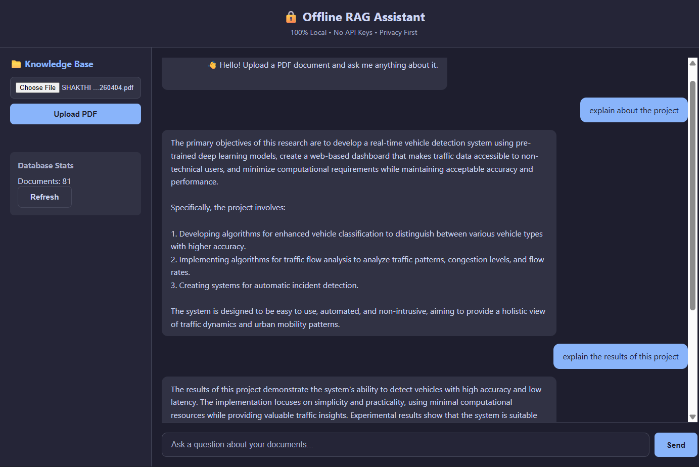
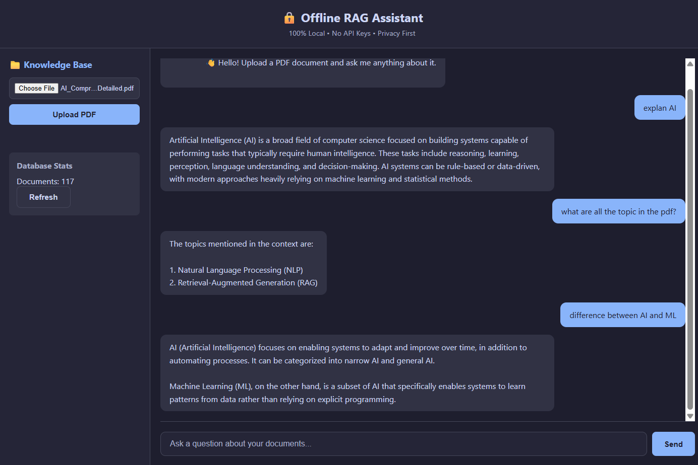

# RAG

Built a simple RAG system using Python and Vanilla JavaScript, it allows users to chat with PDF documents using local LLMs (Ollama) and embeddings (Sentence Transformers) without any API costs or data egress. Features a FastAPI backend, persistent vector storage (ChromaDB), and a lightweight custom frontend

# Demo

## 

## 

## 🛠️ Tech Stack

| Component         | Technology                        | Why?                               |
| ----------------- | --------------------------------- | ---------------------------------- |
| **Backend**       | FastAPI, Python 3.9+              | Async support, auto docs, fast     |
| **Frontend**      | HTML, CSS, JavaScript             | No framework overhead, lightweight |
| **LLM**           | Ollama (Llama 3.1 8B)             | Local inference, privacy           |
| **Embeddings**    | Sentence Transformers (BGE-small) | Best free embedding model          |
| **Vector DB**     | ChromaDB                          | Persistent, no server setup        |
| **Orchestration** | LangChain                         | Industry standard for RAG          |
| **PDF Parsing**   | PyPDF                             | Pure Python, no dependencies       |

---

## 🧠 How It Works

1. Upload PDF
2. Extract and split text into chunks
3. Generate embeddings (Sentence Transformers)
4. Store in ChromaDB
5. User query → embedding → similarity search
6. Relevant chunks + query → LLM (Ollama)
7. Response generated

---

## 📦 Installation

### 🔧 Prerequisites

Make sure you have the following installed:

- **Python 3.9+**
- **Ollama** ([Download](https://ollama.com))
- **Git**

---

### 1️⃣ Clone the Repository

```bash
git clone https://github.com/shakthi-1307/rag-project.git
cd rag-project
```

---

### 2️⃣ Install Ollama & Pull Model

```bash
# Start Ollama (if not already running)
ollama serve

# Pull the Llama 3.1 model (one-time setup ~4.7GB)
ollama pull llama3.1
```

---

### 3️⃣ Install Python Dependencies

```bash
cd backend
pip install -r requirements.txt
```

---

### 4️⃣ Create Required Directories

```bash
mkdir -p data/uploaded
mkdir -p data/sample_docs
touch data/uploaded/.gitkeep
```

---

## 🏃 Running the Project

Open **3 terminals** and run the following:

### 🖥️ Terminal 1 – Start Backend

```bash
cd backend
python main.py
```

---

### 🌐 Terminal 2 – Start Frontend

```bash
cd frontend
python -m http.server 3000
```

---

### ⚙️ Terminal 3 – Run Ollama

```bash
ollama serve
```

---

### 🌍 Open in Browser

```
http://localhost:3000
```

---

🏗️ Architecture
[ User Browser ] <--HTTP--> [ FastAPI Backend ] <--Local--> [ Ollama ]
^ |
| v
| [ ChromaDB ]
| ^
| |
+-------- [ Upload PDF ] ------+

---

🤝 Contributing
Fork the repository
Create a feature branch (git checkout -b feature/amazing-feature)
Commit your changes (git commit -m 'Add amazing feature')
Push to the branch (git push origin feature/amazing-feature)
Open a Pull Request

---

## 📬 Contact

- **Shakthi Chellappan**
- 📧 rmshakthichellappan@gmail.com
- 🔗 LinkedIn: https://www.linkedin.com/in/shakthichellappan/
- 💻 GitHub: https://github.com/shakthi-1307
